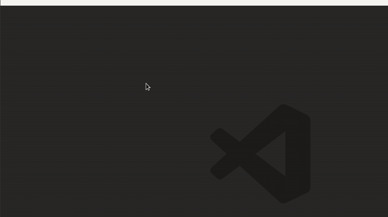

Showkeys
--------

> this is a mod version of <https://github.com/nibrahim/showkeys>
>
> with NO REPEATS bug fixed
>
> with `KeyStack` size fixed to 1
>
> allow user config via OS env vars


```ini
SK_POS=[top|bottom], default to top
SK_ALIGN=[center|left|right], default to center
SK_FG=X11 rgb.txt color, default to OliveDrab
SK_OFFSET=vertical offset, default to 400
SK_H_OFFSET=horizontal offset, default to 0
SK_OUTLINE=outline color, default to Black
SK_OL_OFFSET=shadow color, default to Olive
```

Showkeys is a simple program to display keys being pressed on the screen. 

It is useful while making presentations and screencasts. The audience
will be able to see the keys being pressed.

It is similar to [key-mon](http://code.google.com/p/key-mon/). Key-mon
has more features than showkeys. The advantages of showkeys are

1. Doesn't use gtk/gnome.
2. Uses [libxosd](http://sourceforge.net/projects/libxosd/) to display
   keys directly onto the screen.
3. No floating windows that always need to be on top. This is very
   useful if you're using a tiling WM like Xmonad.
4. Keystroke history. key-mon has this but doesn't show
   modifiers. showkeys does this using an Emacs style key notation.

The list of things which key-mon does better than showkeys is far
longer but I wanted something that fixed these specific issues.


Requirements
------------

You will need

1. The Xlib development libraries. (available as `libx11-dev` on Debian). 
2. The libxosd development libraries (available as `libxosd-dev` on Debian).
3. The libXtst development libraries (available as `libxtst-dev` on Debian).
4. Your X server should have the [record](http://www.x.org/releases/X11R7.6/doc/libXtst/recordlib.html) extension enabled. You can check if this is enabled by running `xdpyinfo` and searching the list of extensions for `RECORD`. The command itself is part of the `x11-utils` package (alteast on Debian which I run).

Compiling
---------

1. Unzip the tarball.
2. Edit the file `config.h` configure showkeys.
3. Run `make showkeys`. It should create the executable. 

for Fedora users:

xorg-x11-utils provides `xdpyinfo`
xorg-x11-apps provides `xfontsel`

```bash
git clone https://github.com/ttys3/showkeys.git
sudo dnf install -y xosd-devel xorg-x11-apps xorg-x11-utils
cd showkeys
make showkeys
```

This program uses some [Gnu extensions to libc](http://www.crasseux.com/books/ctutorial/asprintf.html) so might not work with a pure POSIX libc.

Bugs
----

The project is on Github. Please report bugs using the issue tracker.


